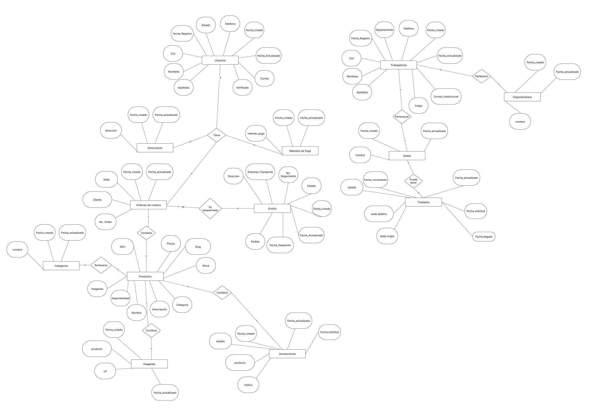
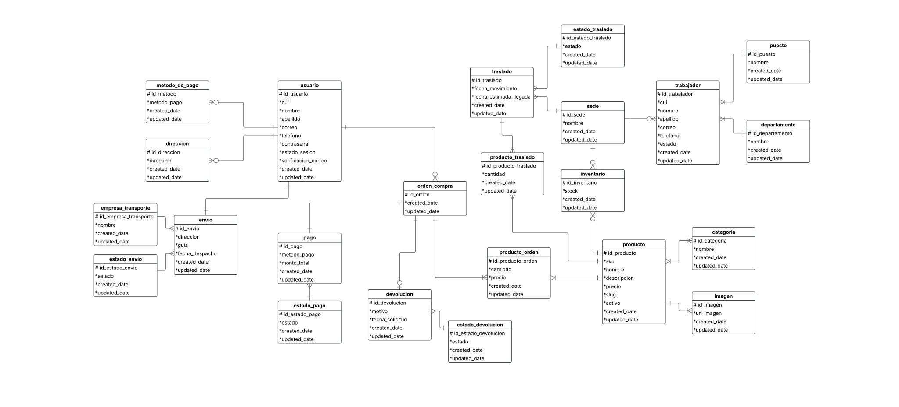
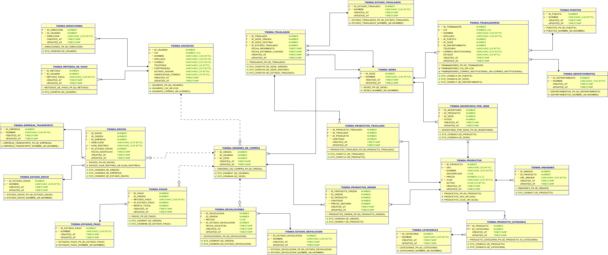

# Manual Técnico - Base de Datos para Centro de Ventas en Línea

## Descripción del Proyecto

Este documento describe el diseño y estructura de la base de datos para un centro de ventas en línea de gran escala, similar a plataformas como Amazon o Alibaba. La base de datos estará diseñada siguiendo principios de eficiencia, integridad referencial y normalización para garantizar un rendimiento óptimo y una administración segura de los datos.

---

## 🎯 Objetivos

### Objetivo General

Garantizar un diseño de base de datos eficiente y seguro para la gestión de ventas en línea, optimizando la organización, almacenamiento y consulta de datos en una plataforma escalable y de alto rendimiento.

### Objetivos Específicos

1. **Estructura eficiente:** Diseñar una base de datos normalizada que garantice integridad y rendimiento óptimo.

2. **Gestión de transacciones:** Implementar procesos seguros para compras, pagos y devoluciones.

3. **Consultas optimizadas:** Crear índices y estrategias para acelerar búsquedas y reportes.

4. **Escalabilidad:** Asegurar que la base de datos pueda manejar un gran volumen de datos y transacciones simultáneas.

5. **Seguridad de datos:** Aplicar mecanismos de autenticación y autorización para proteger la información de usuarios y operaciones.

---

## Esquema conceptual

### 🏛 Entidades Clave

> **Nota:** Las tablas han sido normalizadas y por lo tanto, no corresponden exactamente a las entidades del modelo conceptual. Sin embargo, se han mantenido ciertos campos dentro de las entidades principales, como direcciones en la tabla de clientes o métodos de pago en la tabla de órdenes de compra, para facilitar la comprensión del modelo. Por ejemplo, los productos no son un atributo directo de la tabla "Orden de Compra", ya que se gestionan en una tabla independiente. Para más detalles, consulta la sección de normalización.

---

### 🧑‍💻 Usuarios

| **Atributo**          | **Descripción**                                        |
| --------------------- | ------------------------------------------------------ |
| `id_usuario`          | Identificador único del usuario                        |
| `cui`                 | Documento de identidad del usuario                     |
| `nombre`              | Nombre del usuario                                     |
| `apellido`            | Apellido del usuario                                   |
| `correo`              | Correo electrónico, usado como identificador principal |
| `telefono`            | Número de contacto                                     |
| `contrasena`          | Contraseña encriptada del usuario                      |
| `estado_sesion`       | Indica si el usuario está activo                       |
| `verificacion_correo` | Estado de verificación del correo                      |
| `created_at`          | Fecha de cración del registro                          |
| `updated_at`          | Fecha de la ultima actualización del registro          |
| `Direcciones`         | Listado de direcciones del usuario                     |
| `metodos_de_pago`         | Listado de los metodos de pago del usuario                     |

### 🏢 Trabajadores

| **Atributo**           | **Descripción**                               |
| ---------------------- | --------------------------------------------- |
| `id_trabajador`        | Identificador único del trabajador            |
| `cui`                  | Documento de identidad del trabajador         |
| `nombre`               | Nombre del trabajador                         |
| `apellido`             | Apellido del trabajador                       |
| `puesto`               | Cargo asignado                                |
| `id_departamento`      | ID del departamento donde labora              |
| `telefono`             | Número de contacto                            |
| `correo_institucional` | Correo asignado por la empresa                |
| `id_sede`              | Centro de distribución o sede asignada        |
| `estado`               | Indica si está activo                         |
| `created_at`           | Fecha de cración del registro                 |
| `updated_at`           | Fecha de la ultima actualización del registro |

### 📦 Productos

| **Atributo**   | **Descripción**                               |
| -------------- | --------------------------------------------- |
| `id_producto`  | Identificador único del producto              |
| `sku`          | Código de referencia                          |
| `nombre`       | Nombre del producto                           |
| `descripcion`  | Detalles del producto                         |
| `precio`       | Costo del producto                            |
| `slug`         | URL amigable                                  |
| `categorias` | Categorias a las que pertenece un producto               |
| `activo`       | Estado activo o inactivo                      |
| `created_at`   | Fecha de cración del registro                 |
| `updated_at`   | Fecha de la ultima actualización del registro |
| `imagenes`     | Listado de imagenes del producto              |
| `stock_por_sede`     | Listado de stock del producto por sede              |

### 🛒 Órdenes de Compra

| **Atributo** | **Descripción**                               |
| ------------ | --------------------------------------------- |
| `id_orden`   | Identificador único de la orden               |
| `id_usuario` | ID del usuario que realizó la compra          |
| `id_sede`    | Sede que se encargara del pedido              |
| `created_at` | Fecha de cración del registro                 |
| `updated_at` | Fecha de la ultima actualización del registro |
| `productos`  | Listado de productos de la orden de compra    |

### 🏢 Departamentos

| **Atributo**      | **Descripción**                               |
| ----------------- | --------------------------------------------- |
| `id_departamento` | Identificador único del departamento          |
| `nombre`          | Nombre del departamento                       |
| `created_at`      | Fecha de cración del registro                 |
| `updated_at`      | Fecha de la ultima actualización del registro |

### 🏬 Sedes

| **Atributo** | **Descripción**                               |
| ------------ | --------------------------------------------- |
| `id_sede`    | Identificador único de la sede                |
| `nombre`     | Nombre de la sede                             |
| `created_at` | Fecha de cración del registro                 |
| `updated_at` | Fecha de la ultima actualización del registro |

### 📁 Imágenes

| **Atributo**  | **Descripción**                               |
| ------------- | --------------------------------------------- |
| `id_imagen`   | Identificador único de la imagen              |
| `url`         | URL de la imagen                              |
| `id_producto` | Producto asociado                             |
| `created_at`  | Fecha de cración del registro                 |
| `updated_at`  | Fecha de la ultima actualización del registro |

### 📂 Categorías de Productos

| **Atributo**   | **Descripción**                               |
| -------------- | --------------------------------------------- |
| `id_categoria` | Identificador único de la categoría           |
| `nombre`       | Nombre de la categoría                        |
| `created_at`   | Fecha de cración del registro                 |
| `updated_at`   | Fecha de la ultima actualización del registro |

### 💳 Pago

| **Atributo**  | **Descripción**                               |
| ------------- | --------------------------------------------- |
| `id_pago`     | Identificador único del metodo de pago        |
| `id_orden`    | Identificador de la orden de compra           |
| `metodo_pago` | Metodo de pago usado                          |
| `estado`      | Estado del pago                               |
| `created_at`  | Fecha de cración del registro                 |
| `updated_at`  | Fecha de la ultima actualización del registro |

### 💵 Metodos de pago

| **Atributo**     | **Descripción**                               |
| ---------------- | --------------------------------------------- |
| `id_metodo_pago` | Identificador único del pago                  |
| `id_cliente`     | Identificador del cliente                     |
| `metodo_pago`    | Nombre del método                             |
| `created_at`     | Fecha de cración del registro                 |
| `updated_at`     | Fecha de la ultima actualización del registro |

### 📍 Direcciones

| **Atributo**   | **Descripción**                               |
| -------------- | --------------------------------------------- |
| `id_direccion` | Identificador único                           |
| `id_usuario`   | ID del usuario asociado                       |
| `direccion`    | Detalles de la dirección                      |
| `created_at`   | Fecha de cración del registro                 |
| `updated_at`   | Fecha de la ultima actualización del registro |

### 📦 Envíos

| **Atributo**        | **Descripción**                               |
| ------------------- | --------------------------------------------- |
| `id_envio`          | Identificador único del envío                 |
| `id_orden`          | ID de la orden asociada                       |
| `empresa_encargada` | Empresa encargada de la entrega               |
| `direccion`         | Detalles de la dirección de entrega           |
| `guia_rastreo`      | Numero de tracking del envío                  |
| `estado`            | Estado del envío                              |
| `fecha_despacho`    | Fecha de despacho del envío                   |
| `created_at`        | Fecha de cración del registro                 |
| `updated_at`        | Fecha de la ultima actualización del registro |

### ⛔ Devoluciones

| **Atributo**      | **Descripción**                               |
| ----------------- | --------------------------------------------- |
| `id_devolucion`   | Identificador único de la devolución          |
| `id_orden`     | ID del producto asociado                      |
| `motivo`          | Motivo de la devolucion                       |
| `estado`          | Estado de la solicitud                        |
| `fecha_solicitud` | Fecha de la solicitud                         |
| `created_at`      | Fecha de cración del registro                 |
| `updated_at`      | Fecha de la ultima actualización del registro |

### 🛻 Traslados

| **Atributo**             | **Descripción**                               |
| ------------------------ | --------------------------------------------- |
| `id_traslado`            | Identificador único del traslado              |
| `id_sede_origen`         | ID de la sede de origen                       |
| `id_sede_destino`        | ID de la sede destino                         |
| `estado`                 | Estado de la solicitud                        |
| `fecha_movimiento`       | Fecha del movimiento                          |
| `fecha_estimada_llegada` | Fecha estimada de la llegada del producto     |
| `created_at`             | Fecha de cración del registro                 |
| `updated_at`             | Fecha de la ultima actualización del registro |
| `productos`              | Listado de productos a trasladar              |

<br><br>
<div align="center"> 
     
    <br> <em>Figura 1: Esquema conceptual de la base de datos.</em> 
</div>

---

## Esquema lógico

---

### Normalización

#### **📌 Resumen del proceso de normalización**

| Forma Normal | Problema resuelto |
|--------------|-------------------|
| **<span style='color:red;'>1FN</span>** | Eliminar valores repetidos o agrupados en una sola celda. |
| **<span style='color:yellow;'>2FN</span>** | Eliminar dependencias parciales de la clave primaria. |
| **<span style='color:orange;'>3FN</span>** | Eliminar dependencias transitivas. |
---

#### **Normalización de la Tabla Usuarios**

#### **📌 Tabla Original (Sin Normalización)**

| id_usuario | cui       | nombre   | apellido | correo                     | telefono  | contraseña | estado_sesion | verificacion_correo | <span style='color:red;'>direcciones</span> | created_at | updated_at |<span style='color:red;'>metodos de pago</span> |
|------------|-----------|----------|----------|----------------------------|-----------|------------|---------------|---------------------|----------------------------------------------|------------|------------|------------------------------------|
| 1          | 32915904  | Irving   | Alvarado | fercho.asensio@gmail.com    | 55456000  | 200dfr$    | ACTIVO        | TRUE                | dirección 1, dirección 2, dirección 3      | 24/02/2025 | 24/02/2025 | visa 123, visa 345               |

---

#### **✅ Primera Forma Normal (1FN)**

📌 **Correcciones:**
- Separamos `direcciones` en una tabla independiente.
- Separamos `metodos de pago` en una tabla independiente, ya que un usuario puede tener múltiples métodos de pago.

#### **Usuarios (1FN)**

| id_usuario | cui       | nombre   | apellido | correo                     | telefono  | contraseña | estado_sesion | verificacion_correo | created_at | updated_at |
|------------|-----------|----------|----------|----------------------------|-----------|------------|---------------|---------------------|------------|------------|
| 1          | 32915904  | Irving   | Alvarado | fercho.asensio@gmail.com    | 55456000  | 200dfr$    | ACTIVO        | TRUE                | 24/02/2025 | 24/02/2025 |

#### **Direcciones (1FN)**

| id_direccion | id_usuario | direccion   | created_at | updated_at |
|--------------|------------|-------------|------------|------------|
| 1            | 1          | dirección 1 | 24/02/2025 | 24/02/2025 |
| 2            | 1          | dirección 2 | 24/02/2025 | 24/02/2025 |
| 3            | 1          | dirección 3 | 24/02/2025 | 24/02/2025 |

#### **Metodos de Pago (1FN)**

| id_metodo | id_usuario | metodo_pago | created_at | updated_at |
|-----------|------------|-------------|------------|------------|
| 1         | 1          | visa 123    | 24/02/2025 | 24/02/2025 |
| 2         | 1          | visa 345    | 24/02/2025 | 24/02/2025 |

#### **✅ Segunda Forma Normal (2FN)**

📌 **Correcciones:**
- La tabla ya está en **1FN**. En este caso, no se presentan dependencias parciales, ya que todos los atributos dependen completamente de la clave primaria (`id_usuario` en **Usuarios** y `id_metodo` en **Metodos de Pago**). No es necesario realizar más modificaciones en esta fase.

#### **Usuarios (2FN)**

| id_usuario | cui       | nombre   | apellido | correo                     | telefono  | contraseña | estado_sesion | verificacion_correo | created_at | updated_at |
|------------|-----------|----------|----------|----------------------------|-----------|------------|---------------|---------------------|------------|------------|
| 1          | 32915904  | Irving   | Alvarado | fercho.asensio@gmail.com    | 55456000  | 200dfr$    | ACTIVO        | TRUE                | 24/02/2025 | 24/02/2025 |

#### **Direcciones (2FN)**

| id_direccion | id_usuario | direccion   | created_at | updated_at |
|--------------|------------|-------------|------------|------------|
| 1            | 1          | dirección 1 | 24/02/2025 | 24/02/2025 |
| 2            | 1          | dirección 2 | 24/02/2025 | 24/02/2025 |
| 3            | 1          | dirección 3 | 24/02/2025 | 24/02/2025 |

#### **Metodos de Pago (2FN)**

| id_metodo | id_usuario | metodo_pago | created_at | updated_at |
|-----------|------------|-------------|------------|------------|
| 1         | 1          | visa 123    | 24/02/2025 | 24/02/2025 |
| 2         | 1          | visa 345    | 24/02/2025 | 24/02/2025 |


#### **✅ Tercera Forma Normal (3FN)**

📌 **Correcciones:**
- La tabla **Usuarios** ya está en **2FN** y no presenta dependencias transitivas, por lo que está lista para la **3FN** sin necesidad de modificaciones adicionales.
- En cuanto a la tabla **Metodos de Pago**, no hay dependencias transitivas, ya que cada método de pago está relacionado directamente con el usuario que lo posee. No es necesario realizar más cambios.

#### **Usuarios (3FN)**

| id_usuario | cui       | nombre   | apellido | correo                     | telefono  | contraseña | estado_sesion | verificacion_correo | created_at | updated_at |
|------------|-----------|----------|----------|----------------------------|-----------|------------|---------------|---------------------|------------|------------|
| 1          | 32915904  | Irving   | Alvarado | fercho.asensio@gmail.com    | 55456000  | 200dfr$    | ACTIVO        | TRUE                | 24/02/2025 | 24/02/2025 |

#### **Direcciones (3FN)**

| id_direccion | id_usuario | direccion   | created_at | updated_at |
|--------------|------------|-------------|------------|------------|
| 1            | 1          | dirección 1 | 24/02/2025 | 24/02/2025 |
| 2            | 1          | dirección 2 | 24/02/2025 | 24/02/2025 |
| 3            | 1          | dirección 3 | 24/02/2025 | 24/02/2025 |

#### **Metodos de Pago (3FN)**

| id_metodo | id_usuario | metodo_pago | created_at | updated_at |
|-----------|------------|-------------|------------|------------|
| 1         | 1          | visa 123    | 24/02/2025 | 24/02/2025 |
| 2         | 1          | visa 345    | 24/02/2025 | 24/02/2025 |


---

#### **Normalización de la Tabla Trabajadores**

#### **📌 Tabla Original (Sin Normalización)**

| id_trabajador | cui        | nombre   | apellido | puesto       | sede            | departamento   | telefono   | correo_institucional          | estado | created_at | updated_at |
|--------------|------------|----------|----------|--------------|-----------------|----------------|------------|-------------------------------|--------|------------|------------|
| 1            | 32915904   | Irving   | Alvarado | Desarrollador| Sede Central    | Desarrollo     | 55456000   | irving.alvarado@empresa.com   | ACTIVO | 24/02/2025 | 24/02/2025 |


### **✅ Primera Forma Normal (1FN)**

📌 **Correcciones:**
- Se eliminan los grupos de valores repetidos o múltiples dentro de una celda.
- En este caso, la tabla original **ya cumple con 1FN**, porque todos los valores son atómicos y no hay listas dentro de celdas.
- **No se crean nuevas tablas en esta fase.**

#### **Trabajadores (1FN)** *(Sin cambios respecto a la original)*

| id_trabajador | cui        | nombre   | apellido | puesto       | sede            | departamento   | telefono   | correo_institucional          | estado | created_at | updated_at |
|--------------|------------|----------|----------|--------------|-----------------|----------------|------------|-------------------------------|--------|------------|------------|
| 1            | 32915904   | Irving   | Alvarado | Desarrollador| Sede Central    | Desarrollo     | 55456000   | irving.alvarado@empresa.com   | ACTIVO | 24/02/2025 | 24/02/2025 |


### **✅ Segunda Forma Normal (2FN)**

📌 **Correcciones:**
- Se identifican **dependencias parciales**: **sede** y **departamento** no dependen directamente de la clave primaria de **Trabajadores**, sino que podrían ser entidades independientes.
- Se crean las tablas **Sedes** y **Departamentos**, reemplazando sus valores en **Trabajadores** con claves foráneas.

#### **Trabajadores (2FN)**

| id_trabajador | cui        | nombre   | apellido | puesto       | id_sede | id_departamento | telefono   | correo_institucional          | estado | created_at | updated_at |
|--------------|------------|----------|----------|--------------|---------|-----------------|------------|-------------------------------|--------|------------|------------|
| 1            | 32915904   | Irving   | Alvarado | Desarrollador| 1       | 1               | 55456000   | irving.alvarado@empresa.com   | ACTIVO | 24/02/2025 | 24/02/2025 |

#### **Sedes (2FN)**

| id_sede | nombre         | created_at | updated_at |
|---------|--------------|------------|------------|
| 1       | Sede Central | 24/02/2025 | 24/02/2025 |

#### **Departamentos (2FN)**

| id_departamento | nombre      | created_at | updated_at |
|-----------------|------------|------------|------------|
| 1               | Desarrollo | 24/02/2025 | 24/02/2025 |


### **✅ Tercera Forma Normal (3FN)**

📌 **Correcciones:**
- **puesto** no es una clave primaria ni depende directamente de la clave primaria de **Trabajadores**, ya que un puesto puede tener atributos propios (ejemplo: salario, descripción).
- Se crea la tabla **Puestos** y se reemplaza la columna **puesto** en **Trabajadores** con **id_puesto**.

#### **Trabajadores (3FN)**

| id_trabajador | cui        | nombre   | apellido | id_puesto | id_sede | id_departamento | telefono   | correo_institucional          | estado | created_at | updated_at |
|--------------|------------|----------|----------|----------|---------|-----------------|------------|-------------------------------|--------|------------|------------|
| 1            | 32915904   | Irving   | Alvarado | 1        | 1       | 1               | 55456000   | irving.alvarado@empresa.com   | ACTIVO | 24/02/2025 | 24/02/2025 |

#### **Puestos (3FN)**

| id_puesto | nombre         | created_at | updated_at |
|-----------|---------------|------------|------------|
| 1         | Desarrollador | 24/02/2025 | 24/02/2025 |

---

# Normalización de la Tabla Productos

## 📌 Tabla Original (Sin Normalización)

### Ejemplo de Registro:

| id_producto | sku  | nombre       | descripcion    | precio | slug       | categorias         | activo | created_at | updated_at | imagenes              | stock_por_sede         |
|------------|------|-------------|---------------|--------|-----------|-------------------|--------|------------|------------|-----------------------|-----------------------|
| 1          | A001 | Producto A  | Descripción A | 100.00 | producto-a | Electrónica, Ropa | 1      | 26/02/2025 | 26/02/2025 | img1.jpg, img2.jpg    | Sede 1: 10, Sede 2: 5 |


## ✅ Primera Forma Normal (1FN)

📌 **Correcciones:**
- **Separamos el campo `imagenes`**, ya que contiene múltiples valores en una sola celda. Creamos la tabla **Imágenes**.
- **Separamos el campo `stock_por_sede`**, ya que contiene valores multivaluados. Creamos la tabla **Inventario por Sede**.
- **Separamos el campo `categorias`**, ya que contiene múltiples valores en una sola celda. Creamos la tabla **Categorías** y la tabla intermedia **Producto_Categoria**.

### **Productos (1FN)**

| id_producto | sku  | nombre       | descripcion    | precio | slug       | activo | created_at | updated_at |
|------------|------|-------------|---------------|--------|-----------|--------|------------|------------|
| 1          | A001 | Producto A  | Descripción A | 100.00 | producto-a | 1      | 26/02/2025 | 26/02/2025 |
| 2          | A002 | Producto B  | Descripción B | 200.00 | producto-b | 1      | 26/02/2025 | 26/02/2025 |

### **Imágenes (1FN)**

| id_imagen | id_producto | url_imagen  | created_at | updated_at |
|-----------|------------|------------|------------|------------|
| 1         | 1          | img1.jpg   | 26/02/2025 | 26/02/2025 |
| 2         | 1          | img2.jpg   | 26/02/2025 | 26/02/2025 |
| 3         | 2          | img3.jpg   | 26/02/2025 | 26/02/2025 |
| 4         | 2          | img4.jpg   | 26/02/2025 | 26/02/2025 |

### **Inventario por Sede (1FN)**

| id_inventario | id_producto | id_sede | stock | created_at | updated_at |
|--------------|------------|--------|-------|------------|------------|
| 1            | 1          | 1      | 10    | 26/02/2025 | 26/02/2025 |
| 2            | 1          | 2      | 5     | 26/02/2025 | 26/02/2025 |
| 3            | 2          | 1      | 8     | 26/02/2025 | 26/02/2025 |
| 4            | 2          | 2      | 3     | 26/02/2025 | 26/02/2025 |

### **Categorías (1FN)**

| id_categoria | nombre       | created_at | updated_at |
|-------------|-------------|------------|------------|
| 1           | Electrónica | 26/02/2025 | 26/02/2025 |
| 2           | Ropa        | 26/02/2025 | 26/02/2025 |

### **Producto_Categoria (1FN)**

| id_producto | id_categoria | created_at | updated_at |
|------------|-------------|------------|------------|
| 1          | 1           | 26/02/2025 | 26/02/2025 |
| 1          | 2           | 26/02/2025 | 26/02/2025 |
| 2          | 1           | 26/02/2025 | 26/02/2025 |


## ✅ Segunda Forma Normal (2FN)

📌 **Correcciones:**
- La tabla **Productos** ya está en **2FN**, ya que no hay dependencias parciales (todos los atributos dependen completamente de `id_producto`).
- Las tablas **Imágenes**, **Inventario por Sede**, **Categorías** y **Producto_Categoria** también cumplen con la 2FN.

### **Productos (2FN)** *(Sin cambios respecto a 1FN)*

| id_producto | sku  | nombre       | descripcion    | precio | slug       | activo | created_at | updated_at |
|------------|------|-------------|---------------|--------|-----------|--------|------------|------------|
| 1          | A001 | Producto A  | Descripción A | 100.00 | producto-a | 1      | 26/02/2025 | 26/02/2025 |
| 2          | A002 | Producto B  | Descripción B | 200.00 | producto-b | 1      | 26/02/2025 | 26/02/2025 |


## ✅ Tercera Forma Normal (3FN)

📌 **Correcciones:**
- La tabla **Productos** ya está en **3FN**, ya que no hay dependencias transitivas.
- Las tablas **Imágenes**, **Inventario por Sede**, **Categorías** y **Producto_Categoria** también cumplen con la 3FN.

### **Productos (3FN)** *(Sin cambios respecto a 2FN)*

| id_producto | sku  | nombre       | descripcion    | precio | slug       | activo | created_at | updated_at |
|------------|------|-------------|---------------|--------|-----------|--------|------------|------------|
| 1          | A001 | Producto A  | Descripción A | 100.00 | producto-a | 1      | 26/02/2025 | 26/02/2025 |
| 2          | A002 | Producto B  | Descripción B | 200.00 | producto-b | 1      | 26/02/2025 | 26/02/2025 |

## ✅ Resumen de Cambios:
1. **Primera Forma Normal (1FN):**
   - Se separaron los campos multivaluados (`imagenes`, `stock_por_sede`, `categorias`) en tablas independientes.
   - Se crearon las tablas **Imágenes**, **Inventario por Sede**, **Categorías** y **Producto_Categoria**.

2. **Segunda Forma Normal (2FN):**
   - No se requirieron cambios adicionales, ya que todas las tablas cumplían con la 2FN.

3. **Tercera Forma Normal (3FN):**
   - No se requirieron cambios adicionales, ya que todas las tablas cumplían con la 3FN.


---
#### **Normalización de la Tabla Órdenes de Compra**

#### **📌 Tabla Original (Sin Normalización)**

| id_orden | id_usuario | id_sede | created_at | updated_at | productos                 |
|----------|------------|---------|------------|------------|---------------------------|
| 1        | 1          | 1       | 24/02/2025 | 24/02/2025 | Producto A, Producto B    |

#### **✅ Primera Forma Normal (1FN)**

📌 **Correcciones:**
- Separamos el campo **productos**, ya que contiene múltiples valores en una sola celda. Cada producto debe estar en una fila separada.
- Creamos una nueva tabla para **Productos_Orden** que relaciona las órdenes de compra con los productos seleccionados.

#### **Órdenes de Compra (1FN)**

| id_orden | id_usuario | id_sede | created_at | updated_at |
|----------|------------|---------|------------|------------|
| 1        | 1          | 1       | 24/02/2025 | 24/02/2025 |

#### **Productos_Orden (1FN)**

| id_producto_orden | id_orden | id_producto | cantidad | precio | created_at |updated_at|
|-------------------|----------|-------------|------------|------------|------------|------------|
| 1 | 1 | 1 | 10 | 18 | 05/03/2025 |05/03/2025|
| 2 | 1 | 5 | 9 | 25 | 05/03/2025 |05/03/2025|


#### **✅ Segunda Forma Normal (2FN)**

📌 **Correcciones:**
- La tabla **Órdenes de Compra** ya está en **1FN**. En este caso, no se presentan dependencias parciales, por lo que ya está lista para la **2FN** sin necesidad de modificaciones adicionales.

#### **Órdenes de Compra (2FN)**

| id_orden | id_usuario | id_sede | created_at | updated_at |
|----------|------------|---------|------------|------------|
| 1        | 1          | 1       | 24/02/2025 | 24/02/2025 |

#### **✅ Tercera Forma Normal (3FN)**

📌 **Correcciones:**
- La tabla **Órdenes de Compra** ya está en **2FN** y no presenta dependencias transitivas, por lo que ya está lista para la **3FN** sin necesidad de modificaciones adicionales.
---
#### **Normalización de la Tabla Pago**

#### **📌 Tabla Original (Sin Normalización)**

| id_pago | id_orden | metodo_pago | estado     | created_at | updated_at |
|---------|---------|-------------|------------|------------|------------|
| 1       | 1       | Tarjeta     | Completado | 24/02/2025 | 24/02/2025 |


### **✅ Primera Forma Normal (1FN)**

📌 **Correcciones:**
- La tabla **Pago** ya cumple con **1FN** porque no tiene valores multivaluados ni campos que necesiten ser separados.
- **No se realizan cambios en esta fase.**

#### **Pago (1FN)** *(Sin cambios respecto a la original)*

| id_pago | id_orden | metodo_pago | estado     | created_at | updated_at |
|---------|---------|-------------|------------|------------|------------|
| 1       | 1       | Tarjeta     | Completado | 24/02/2025 | 24/02/2025 |


### **✅ Segunda Forma Normal (2FN)**

📌 **Correcciones:**
- **estado** no depende de la clave primaria **id_pago**, sino que representa un conjunto de valores predefinidos.
- Se crea la tabla **Estado_Pagos** y se reemplaza la columna **estado** en **Pago** con **id_estado_pago** como clave foránea.

#### **Pago (2FN)**

| id_pago | id_orden | metodo_pago | id_estado_pago | created_at | updated_at |
|---------|---------|-------------|---------------|------------|------------|
| 1       | 1       | Tarjeta     | 1             | 24/02/2025 | 24/02/2025 |

#### **Estado_Pagos (2FN)**

| id_estado_pago | estado      | created_at | updated_at |
|---------------|------------|------------|------------|
| 1             | Completado | 24/02/2025 | 24/02/2025 |
| 2             | Pendiente  | 24/02/2025 | 24/02/2025 |
| 3             | Rechazado  | 24/02/2025 | 24/02/2025 |


### **✅ Tercera Forma Normal (3FN)**

📌 **Correcciones:**
- **No hay dependencias transitivas** en **Pago** ni en **Estado_Pagos**, por lo que ya cumplen con **3FN**.
- **No se requieren cambios adicionales en esta fase.**

#### **Pago (3FN)** *(Sin cambios respecto a 2FN)*

| id_pago | id_orden | metodo_pago | id_estado_pago | created_at | updated_at |
|---------|---------|-------------|---------------|------------|------------|
| 1       | 1       | Tarjeta     | 1             | 24/02/2025 | 24/02/2025 |

#### **Estado_Pagos (3FN)** *(Sin cambios respecto a 2FN)*

| id_estado_pago | estado      | created_at | updated_at |
|---------------|------------|------------|------------|
| 1             | Completado | 24/02/2025 | 24/02/2025 |
| 2             | Pendiente  | 24/02/2025 | 24/02/2025 |
| 3             | Rechazado  | 24/02/2025 | 24/02/2025 |

---
#### **Normalización de la Tabla Envíos**

#### **📌 Tabla Original (Sin Normalización)**

| id_envio | id_orden | empresa_encargada | direccion        | guia_rastreo | estado     | fecha_despacho | created_at | updated_at |
|---------|---------|------------------|-----------------|-------------|------------|---------------|------------|------------|
| 1       | 1       | DHL              | Calle 123       | TRK123456   | En tránsito | 25/02/2025    | 24/02/2025 | 24/02/2025 |


### **✅ Primera Forma Normal (1FN)**

📌 **Correcciones:**
- La tabla **Envíos** ya cumple con **1FN** porque no tiene valores multivaluados ni campos que necesiten separarse.
- **No se realizan cambios en esta fase.**

#### **Envíos (1FN)** *(Sin cambios respecto a la original)*

| id_envio | id_orden | empresa_encargada | direccion        | guia_rastreo | estado     | fecha_despacho | created_at | updated_at |
|---------|---------|------------------|-----------------|-------------|------------|---------------|------------|------------|
| 1       | 1       | DHL              | Calle 123       | TRK123456   | En tránsito | 25/02/2025    | 24/02/2025 | 24/02/2025 |


### **✅ Segunda Forma Normal (2FN)**

📌 **Correcciones:**
- La columna **empresa_encargada** representa una entidad separada con valores repetitivos.
- Se crea la tabla **Empresas_Transporte** y se reemplaza la columna **empresa_encargada** en **Envíos** con **id_empresa_transporte** como clave foránea.

#### **Envíos (2FN)**

| id_envio | id_orden | id_empresa_transporte | direccion        | guia_rastreo | estado     | fecha_despacho | created_at | updated_at |
|---------|---------|----------------------|-----------------|-------------|------------|---------------|------------|------------|
| 1       | 1       | 1                    | Calle 123       | TRK123456   | En tránsito | 25/02/2025    | 24/02/2025 | 24/02/2025 |

#### **Empresas_Transporte (2FN)**

| id_empresa_transporte | nombre  | created_at | updated_at |
|----------------------|--------|------------|------------|
| 1                    | DHL    | 24/02/2025 | 24/02/2025 |
| 2                    | FedEx  | 24/02/2025 | 24/02/2025 |
| 3                    | UPS    | 24/02/2025 | 24/02/2025 |


### **✅ Tercera Forma Normal (3FN)**

📌 **Correcciones:**
- La columna **estado** representa un conjunto de valores predefinidos, por lo que se extrae a una nueva tabla llamada **Estado_Envio**.
- Se reemplaza la columna **estado** en **Envíos** con **id_estado_envio** como clave foránea.

#### **Envíos (3FN)**

| id_envio | id_orden | id_empresa_transporte | direccion        | guia_rastreo | id_estado_envio | fecha_despacho | created_at | updated_at |
|---------|---------|----------------------|-----------------|-------------|---------------|---------------|------------|------------|
| 1       | 1       | 1                    | Calle 123       | TRK123456   | 1             | 25/02/2025    | 24/02/2025 | 24/02/2025 |

#### **Estado_Envio (3FN)**

| id_estado_envio | estado       | created_at | updated_at |
|---------------|-------------|------------|------------|
| 1             | En tránsito | 24/02/2025 | 24/02/2025 |
| 2             | Entregado   | 24/02/2025 | 24/02/2025 |
| 3             | Pendiente   | 24/02/2025 | 24/02/2025 |

---

#### **Normalización de la Tabla Devoluciones**

#### **📌 Tabla Original (Sin Normalización)**

| id_devolucion | id_orden | motivo               | estado     | fecha_solicitud | created_at | updated_at |
|--------------|---------|----------------------|-----------|----------------|------------|------------|
| 1            | 1       | Producto defectuoso  | Pendiente | 26/02/2025     | 26/02/2025 | 26/02/2025 |


### **✅ Primera Forma Normal (1FN)**

📌 **Correcciones:**
- La tabla **Devoluciones** ya cumple con **1FN** porque no tiene valores multivaluados ni campos que necesiten separarse.
- **No se realizan cambios en esta fase.**

#### **Devoluciones (1FN)** *(Sin cambios respecto a la original)*

| id_devolucion | id_orden | motivo               | estado     | fecha_solicitud | created_at | updated_at |
|--------------|---------|----------------------|-----------|----------------|------------|------------|
| 1            | 1       | Producto defectuoso  | Pendiente | 26/02/2025     | 26/02/2025 | 26/02/2025 |


### **✅ Segunda Forma Normal (2FN)**

📌 **Correcciones:**
- La tabla **Devoluciones** ya está en **2FN**, ya que todos los atributos dependen de la clave primaria **id_devolucion**.
- **No se realizan cambios en esta fase.**

#### **Devoluciones (2FN)** *(Sin cambios respecto a 1FN)*

| id_devolucion | id_orden | motivo               | estado     | fecha_solicitud | created_at | updated_at |
|--------------|---------|----------------------|-----------|----------------|------------|------------|
| 1            | 1       | Producto defectuoso  | Pendiente | 26/02/2025     | 26/02/2025 | 26/02/2025 |


### **✅ Tercera Forma Normal (3FN)**

📌 **Correcciones:**
- La columna **estado** representa un conjunto de valores predefinidos, por lo que se extrae a una nueva tabla llamada **Estado_Devolucion**.
- Se reemplaza la columna **estado** en **Devoluciones** con **id_estado_devolucion** como clave foránea.

#### **Devoluciones (3FN)**

| id_devolucion | id_orden | motivo               | id_estado_devolucion | fecha_solicitud | created_at | updated_at |
|--------------|---------|----------------------|---------------------|----------------|------------|------------|
| 1            | 1       | Producto defectuoso  | 1                   | 26/02/2025     | 26/02/2025 | 26/02/2025 |

#### **Estado_Devolucion (3FN)**

| id_estado_devolucion | estado      | created_at | updated_at |
|---------------------|------------|------------|------------|
| 1                   | Pendiente  | 26/02/2025 | 26/02/2025 |
| 2                   | Aprobada   | 26/02/2025 | 26/02/2025 |
| 3                   | Rechazada  | 26/02/2025 | 26/02/2025 |

---

#### **Normalización de la Tabla Traslados**

#### **📌 Tabla Original (Sin Normalización)**

| id_traslado | id_sede_origen | id_sede_destino | estado    | fecha_movimiento | fecha_estimada_llegada | created_at | updated_at | productos             | cantidades  |
|------------|---------------|----------------|----------|------------------|------------------------|------------|------------|----------------------|------------|
| 1          | 1             | 2              | Pendiente | 26/02/2025       | 28/02/2025             | 26/02/2025 | 26/02/2025 | Producto A, Producto B | 5, 10      |

### **✅ Primera Forma Normal (1FN)**

📌 **Correcciones:**
- Separamos los valores multivaluados en **productos** y **cantidades**, creando la tabla **Productos_Traslado**.
- Cada producto tendrá una fila separada en esta nueva tabla.

#### **Traslados (1FN)**

| id_traslado | id_sede_origen | id_sede_destino | estado    | fecha_movimiento | fecha_estimada_llegada | created_at | updated_at |
|------------|---------------|----------------|----------|------------------|------------------------|------------|------------|
| 1          | 1             | 2              | Pendiente | 26/02/2025       | 28/02/2025             | 26/02/2025 | 26/02/2025 |

#### **Productos_Traslado (1FN)**

| id_producto_traslado | id_traslado | id_producto | cantidad | created_at | updated_at |
|---------------------|------------|------------|---------|------------|------------|
| 1                   | 1          | 1          | 5       | 26/02/2025 | 26/02/2025 |
| 2                   | 1          | 2          | 10      | 26/02/2025 | 26/02/2025 |


### **✅ Segunda Forma Normal (2FN)**

📌 **Correcciones:**
- La tabla **Traslados** ya está en **2FN** porque no tiene dependencias parciales: todos los atributos dependen de **id_traslado**.
- **No se realizan cambios en esta fase.**

#### **Traslados (2FN)** *(Sin cambios respecto a 1FN)*

| id_traslado | id_sede_origen | id_sede_destino | estado    | fecha_movimiento | fecha_estimada_llegada | created_at | updated_at |
|------------|---------------|----------------|----------|------------------|------------------------|------------|------------|
| 1          | 1             | 2              | Pendiente | 26/02/2025       | 28/02/2025             | 26/02/2025 | 26/02/2025 |


### **✅ Tercera Forma Normal (3FN)**

📌 **Correcciones:**
- La columna **estado** representa un conjunto de valores predefinidos, por lo que se extrae a una nueva tabla llamada **Estado_Traslado**.
- Se reemplaza la columna **estado** en **Traslados** con **id_estado_traslado** como clave foránea.

#### **Traslados (3FN)**

| id_traslado | id_sede_origen | id_sede_destino | id_estado_traslado | fecha_movimiento | fecha_estimada_llegada | created_at | updated_at |
|------------|---------------|----------------|---------------------|------------------|------------------------|------------|------------|
| 1          | 1             | 2              | 1                   | 26/02/2025       | 28/02/2025             | 26/02/2025 | 26/02/2025 |

#### **Estado_Traslado (3FN)**

| id_estado_traslado | estado      | created_at | updated_at |
|-------------------|------------|------------|------------|
| 1                 | Pendiente  | 26/02/2025 | 26/02/2025 |
| 2                 | En tránsito | 26/02/2025 | 26/02/2025 |
| 3                 | Completado | 26/02/2025 | 26/02/2025 |

---


## 📌 Descripción de las Tablas de la Base de Datos

### **usuarios**
Almacena la información de los usuarios registrados en la plataforma. Contiene datos personales como nombre, correo y teléfono, además de información de autenticación y estado de sesión.

| id_usuario | cui       | nombre   | apellido | correo                     | telefono  | contraseña | estado_sesion | verificacion_correo | created_at | updated_at |
|------------|-----------|----------|----------|----------------------------|-----------|------------|---------------|---------------------|------------|------------|
| 1          | 32915904  | Irving   | Alvarado | fercho.asensio@gmail.com    | 55456000  | 200dfr$    | ACTIVO        | TRUE                | 24/02/2025 | 24/02/2025 |

### **direcciones**
Guarda las direcciones asociadas a cada usuario. Un usuario puede tener múltiples direcciones registradas.

| id_direccion | id_usuario | direccion   | created_at | updated_at |
|--------------|------------|-------------|------------|------------|
| 1            | 1          | dirección 1 | 24/02/2025 | 24/02/2025 |

### **metodos_de_pago**
Registra los métodos de pago que un usuario ha almacenado en su cuenta.

| id_metodo | id_usuario | metodo_pago | created_at | updated_at |
|-----------|------------|-------------|------------|------------|
| 1         | 1          | visa 123    | 24/02/2025 | 24/02/2025 |

### **trabajadores**
Contiene la información de los empleados de la empresa, incluyendo su puesto, sede y departamento.
| id_trabajador | cui        | nombre   | apellido | id_puesto | id_sede | id_departamento | telefono   | correo_institucional          | estado | created_at | updated_at |
|--------------|------------|----------|----------|----------|---------|-----------------|------------|-------------------------------|--------|------------|------------|
| 1            | 32915904   | Irving   | Alvarado | 1        | 1       | 1               | 55456000   | irving.alvarado@empresa.com   | ACTIVO | 24/02/2025 | 24/02/2025 |

### **puestos**
Lista de los distintos cargos que pueden ocupar los trabajadores en la empresa.

| id_puesto | nombre         | created_at | updated_at |
|-----------|---------------|------------|------------|
| 1         | Desarrollador | 24/02/2025 | 24/02/2025 |

### **sedes**
Registra las distintas sedes o sucursales de la empresa.

| id_sede | nombre         | created_at | updated_at |
|---------|--------------|------------|------------|
| 1       | Sede Central | 24/02/2025 | 24/02/2025 |

### **departamentos**
Contiene los departamentos dentro de la organización, como desarrollo, ventas, soporte, etc.

| id_departamento | nombre      | created_at | updated_at |
|-----------------|------------|------------|------------|
| 1               | Desarrollo | 24/02/2025 | 24/02/2025 |

### **productos**
Almacena la información de los productos disponibles para la venta, incluyendo su nombre, descripción y precio


| id_producto | sku  | nombre       | descripcion    | precio | slug       | activo | created_at | updated_at |
|------------|------|-------------|---------------|--------|-----------|--------|------------|------------|
| 1          | A001 | Producto A  | Descripción A | 100.00 | producto-a |   TRUE      | 26/02/2025 | 26/02/2025 |

### **categorías**
Clasifica los productos en distintas categorías, como Electrónica, Ropa, etc.

| id_categoria | nombre       | created_at | updated_at |
|-------------|-------------|------------|------------|
| 1           | Electrónica | 26/02/2025 | 26/02/2025 |


### **producto_categoria**
La tabla producto_categoria permite que un producto pertenezca a múltiples categorías y que una categoría contenga múltiples productos.

| id_producto | id_categoria | created_at | updated_at |
|------------|-------------|------------|------------|


### **imagenes**
Guarda las imágenes asociadas a cada producto.

| id_imagen | id_producto | url_imagen  | created_at | updated_at |
|-----------|------------|------------|------------|------------|
| 1         | 1          | img1.jpg   | 26/02/2025 | 26/02/2025 |

### **inventario_por_sede**
Registra la cantidad de stock disponible de cada producto en cada sede específica.

| id_inventario | id_producto | id_sede | stock | created_at | updated_at |
|--------------|------------|--------|-------|------------|------------|
| 1            | 1          | 1      | 10    | 26/02/2025 | 26/02/2025 |

### **ordenes_de_compra**
Almacena los pedidos realizados por los usuarios, registrando la sede de compra.

| id_orden | id_usuario | id_sede | created_at | updated_at |
|----------|------------|---------|------------|------------|
| 1        | 1          | 1       | 24/02/2025 | 24/02/2025 |

### **productos_orden**
Detalle de los productos dentro de una orden de compra, incluyendo cantidad y precio.

| id_producto_orden | id_orden | id_producto | cantidad | precio | created_at |updated_at|
|-------------------|----------|-------------|------------|------------|------------|------------|
| 1 | 1 | 1 | 10 | 18 | 05/03/2025 |05/03/2025|

### **pagos**
Guarda la información del pago realizado para una orden de compra.

| id_pago | id_orden | metodo_pago | id_estado_pago |monto_total | created_at | updated_at |
|---------|---------|-------------|---------------|------------|------------|------------|
| 1       | 1       | Tarjeta     | 1             | 600 | 24/02/2025 |24/02/2025 |

### **estado_pagos**
Define los distintos estados en los que puede estar un pago (Completado, Pendiente, Rechazado).

| id_estado_pago | estado      | created_at | updated_at |
|---------------|------------|------------|------------|
| 1             | Completado | 24/02/2025 | 24/02/2025 |

### **envios**
Registra la información del envío de los pedidos, incluyendo la dirección de entrega, empresa de transporte y estado del envío.

| id_envio | id_orden | id_empresa_transporte | direccion        | guia_rastreo | id_estado_envio | fecha_despacho | created_at | updated_at |
|---------|---------|----------------------|-----------------|-------------|---------------|---------------|------------|------------|
| 1       | 1       | 1                    | Calle 123       | TRK123456   | 1             | 25/02/2025    | 24/02/2025 | 24/02/2025 |

### **estado_envios**
Lista de los estados posibles para un envío, como "En tránsito", "Entregado" o "Pendiente".

| id_estado_envio | estado       | created_at | updated_at |
|---------------|-------------|------------|------------|
| 1             | En tránsito | 24/02/2025 | 24/02/2025 |

### **empresas_transporte**
Guarda información de las empresas de transporte disponibles para la entrega de los pedidos.

| id_empresa_transporte | nombre  | created_at | updated_at |
|----------------------|--------|------------|------------|
| 1                    | DHL    | 24/02/2025 | 24/02/2025 |

### **devoluciones**
Registra las solicitudes de devolución de productos, junto con el motivo y estado de la solicitud.

| id_devolucion | id_orden | motivo               | id_estado_devolucion | fecha_solicitud | created_at | updated_at |
|--------------|---------|----------------------|---------------------|----------------|------------|------------|
| 1            | 1       | Producto defectuoso  | 1                   | 26/02/2025     | 26/02/2025 | 26/02/2025 |

### **estado_devolucion**
Lista de los posibles estados de una devolución (Pendiente, Aprobada, Rechazada).

| id_estado_devolucion | estado      | created_at | updated_at |
|---------------------|------------|------------|------------|
| 1                   | Pendiente  | 26/02/2025 | 26/02/2025 |

### **traslados**
Registra los movimientos de productos entre sedes, indicando fechas y estado del traslado.

| id_traslado | id_sede_origen | id_sede_destino | id_estado_traslado | fecha_movimiento | fecha_estimada_llegada | created_at | updated_at |
|------------|---------------|----------------|---------------------|------------------|------------------------|------------|------------|
| 1          | 1             | 2              | 1                   | 26/02/2025       | 28/02/2025             | 26/02/2025 | 26/02/2025 |

### **estado_traslados**
Lista de los estados posibles para un traslado de productos entre sedes.

| id_estado_traslado | estado      | created_at | updated_at |
|-------------------|------------|------------|------------|
| 1                 | Pendiente  | 26/02/2025 | 26/02/2025 |

### **productos_traslado**
Detalle de los productos que se están trasladando entre sedes, incluyendo la cantidad de cada uno.

| id_producto_traslado | id_traslado | id_producto | cantidad | created_at | updated_at |
|---------------------|------------|------------|---------|------------|------------|
| 1                   | 1          | 1          | 5       | 26/02/2025 | 26/02/2025 |


---

## 📊 Diagrama Matricial de Relaciones entre Tablas

| **Tablas**               | **usuarios** | **direcciones** | **metodos_de_pago** | **trabajadores** | **puestos** | **sedes** | **departamentos** | **productos** | **categorías** | **imagenes** | **inventario_por_sede** | **ordenes_de_compra** | **productos_orden** | **pagos** | **estado_pagos** | **envios** | **estado_envios** | **empresas_transporte** | **devoluciones** | **estado_devolucion** | **traslados** | **estado_traslados** | **productos_traslado** |
|--------------------------|--------------|-----------------|---------------------|------------------|-------------|-----------|-------------------|---------------|-----------------|--------------|------------------------|-----------------------|---------------------|-----------|-------------------|------------|-------------------|------------------------|------------------|---------------------|--------------|----------------------|-----------------------|
| **usuarios**             |      -       |       1:N       |        1:N          |        -         |      -      |    -      |         -         |      -        |        -        |      -       |            -           |          1:N          |           -         |     -     |        -          |     -      |         -         |           -            |        -         |          -          |      -       |          -           |           -           |
| **direcciones**          |     N:1      |        -        |        -            |        -         |      -      |    -      |         -         |      -        |        -        |      -       |            -           |          -            |           -         |     -     |        -          |     -      |         -         |           -            |        -         |          -          |      -       |          -           |           -           |
| **metodos_de_pago**      |     N:1      |        -        |        -            |        -         |      -      |    -      |         -         |      -        |        -        |      -       |            -           |          -            |           -         |     -     |        -          |     -      |         -         |           -            |        -         |          -          |      -       |          -           |           -           |
| **trabajadores**         |      -       |        -        |        -            |        -         |     N:1     |    N:1    |        N:1        |      -        |        -        |      -       |            -           |          -            |           -         |     -     |        -          |     -      |         -         |           -            |        -         |          -          |      -       |          -           |           -           |
| **puestos**              |      -       |        -        |        -            |     1:N          |      -      |    -      |         -         |      -        |        -        |      -       |            -           |          -            |           -         |     -     |        -          |     -      |         -         |           -            |        -         |          -          |      -       |          -           |           -           |
| **sedes**                |      -       |        -        |        -            |     1:N          |      -      |    -      |         -         |      -        |        -        |      -       |        1:N             |          1:N          |           -         |     -     |        -          |     -      |         -         |           1:N          |        -         |          -          |      -       |          -           |           -           |
| **departamentos**        |      -       |        -        |        -            |     1:N          |      -      |    -      |         -         |      -        |        -        |      -       |            -           |          -            |           -         |     -     |        -          |     -      |         -         |           -            |        -         |          -          |      -       |          -           |           -           |
| **productos**            |      -       |        -        |        -            |        -         |      -      |    -      |         -         |      -        |        1:N      |     1:N      |        1:N             |          -            |           1:N       |     -     |        -          |     -      |         -         |           -            |        -         |          -          |      -       |          -           |           -           |
| **categorías**           |      -       |        -        |        -            |        -         |      -      |    -      |         -         |     1:N       |        -        |      -       |            -           |          -            |           -         |     -     |        -          |     -      |         -         |           -            |        -         |          -          |      -       |          -           |           -           |
| **imagenes**             |      -       |        -        |        -            |        -         |      -      |    -      |         -         |     N:1       |        -        |      -       |            -           |          -            |           -         |     -     |        -          |     -      |         -         |           -            |        -         |          -          |      -       |          -           |           -           |
| **inventario_por_sede**  |      -       |        -        |        -            |        -         |      -      |   N:1     |         -         |     N:1       |        -        |      -       |            -           |          -            |           -         |     -     |        -          |     -      |         -         |           -            |        -         |          -          |      -       |          -           |           -           |
| **ordenes_de_compra**    |     N:1      |        -        |        -            |        -         |      -      |   N:1     |         -         |      -        |        -        |      -       |            -           |          -            |           1:N       |     -     |        -          |     -      |         -         |           -            |        -         |          -          |      -       |          -           |           -           |
| **productos_orden**      |      -       |        -        |        -            |        -         |      -      |    -      |         -         |     N:1       |        -        |      -       |            -           |          N:1          |           -         |     -     |        -          |     -      |         -         |           -            |        -         |          -          |      -       |          -           |           -           |
| **pagos**                |      -       |        -        |        -            |        -         |      -      |    -      |         -         |      -        |        -        |      -       |            -           |          N:1          |           -         |     1:N   |        -          |     -      |         -         |           -            |        -         |          -          |      -       |          -           |           -           |
| **estado_pagos**         |      -       |        -        |        -            |        -         |      -      |    -      |         -         |      -        |        -        |      -       |            -           |          -            |           -         |     N:1   |        -          |     -      |         -         |           -            |        -         |          -          |      -       |          -           |           -           |
| **envios**               |      -       |        -        |        -            |        -         |      -      |    -      |         -         |      -        |        -        |      -       |            -           |          -            |           -         |     -     |        -          |     N:1    |         -         |           N:1          |        -         |          -          |      -       |          -           |           -           |
| **estado_envios**        |      -       |        -        |        -            |        -         |      -      |    -      |         -         |      -        |        -        |      -       |            -           |          -            |           -         |     -     |        N:1        |     -      |         -         |           -            |        -         |          -          |      -       |          -           |           -           |
| **empresas_transporte**  |      -       |        -        |        -            |        -         |      -      |    -      |         -         |      -        |        -        |      -       |            -           |          -            |           -         |     -     |        -          |     N:1    |         -         |           -            |        -         |          -          |      -       |          -           |           -           |
| **devoluciones**         |     N:1      |        -        |        -            |        -         |      -      |    -      |         -         |      -        |        -        |      -       |            -           |          -            |           -         |     -     |        -          |     -      |         -         |           -            |        N:1       |          -          |      -       |          -           |           -           |
| **estado_devolucion**    |      -       |        -        |        -            |        -         |      -      |    -      |         -         |      -        |        -        |      -       |            -           |          -            |           -         |     -     |        -          |     -      |         N:1       |           -            |        -         |          -          |      -       |          -           |           -           |
| **traslados**            |      -       |        -        |        -            |        -         |      -      |   N:1     |         -         |      -        |        -        |      -       |            -           |          -            |           -         |     -     |        -          |     -      |         -         |           -            |        -         |          -          |     1:N      |          -           |           1:N         |
| **estado_traslados**     |      -       |        -        |        -            |        -         |      -      |    -      |         -         |      -        |        -        |      -       |            -           |          -            |           -         |     -     |        -          |     -      |         N:1       |           -            |        -         |          -          |      -       |          -           |           -           |
| **productos_traslado**   |      -       |        -        |        -            |        -         |      -      |    -      |         -         |     N:1       |        -        |      -       |            -           |          -            |           -         |     -     |        -          |     -      |         -         |           -            |        -         |          -          |     N:1      |          -           |           -           |

---

<br><br>
<div align="center"> 
     
    <br> <em>Figura 2: Modelo entidad relación.</em> 
</div>

# Modelo Físico

A continuación se detalla el modelo físico de la base de datos, incluyendo la descripción de cada tabla y su correspondiente código SQL.

<br><br>
<div align="center"> 
     
    <br> <em>Figura 3: Modelo relacional.</em> 
</div>

---

## Tabla `usuarios`

Esta tabla almacena la información de los usuarios del sistema. Cada usuario tiene un identificador único (`id_usuario`), un CUI único, nombre, apellido, correo electrónico, teléfono, contraseña, estado de sesión, verificación de correo y marcas de tiempo para creación y actualización.

```sql
CREATE TABLE usuarios (
    id_usuario NUMBER PRIMARY KEY,
    cui NUMBER(10) UNIQUE NOT NULL,
    nombre VARCHAR2(100) NOT NULL,
    apellido VARCHAR2(100) NOT NULL,
    correo VARCHAR2(255) UNIQUE NOT NULL,
    telefono VARCHAR2(20),
    contrasena VARCHAR2(255) NOT NULL,
    estado_sesion VARCHAR2(20) CHECK (estado_sesion IN ('TRUE', 'FALSE')),
    verificacion_correo VARCHAR2(20) CHECK (verificacion_correo IN ('TRUE', 'FALSE')),
    created_at TIMESTAMP,
    updated_at TIMESTAMP
);
```

## Tabla `direcciones`

Esta tabla almacena las direcciones asociadas a los usuarios. Cada dirección está vinculada a un usuario mediante la clave foránea `id_usuario`.

```sql
CREATE TABLE direcciones (
    id_direccion NUMBER PRIMARY KEY,
    id_usuario NUMBER NOT NULL,
    direccion VARCHAR2(255) NOT NULL,
    created_at TIMESTAMP,
    updated_at TIMESTAMP,
    FOREIGN KEY (id_usuario) REFERENCES usuarios(id_usuario) ON DELETE CASCADE
);
```

## Tabla `metodos_de_pago`

Esta tabla almacena los métodos de pago asociados a los usuarios. Cada método de pago está vinculado a un usuario mediante la clave foránea `id_usuario`.

```sql
CREATE TABLE metodos_de_pago (
    id_metodo NUMBER PRIMARY KEY,
    id_usuario NUMBER NOT NULL,
    metodo_pago VARCHAR2(100) NOT NULL,
    created_at TIMESTAMP,
    updated_at TIMESTAMP,
    FOREIGN KEY (id_usuario) REFERENCES usuarios(id_usuario) ON DELETE CASCADE
);
```

## Tabla `puestos`

Esta tabla almacena los puestos de trabajo disponibles en la organización. Cada puesto tiene un nombre único y marcas de tiempo para creación y actualización.

```sql
CREATE TABLE puestos (
    id_puesto NUMBER GENERATED ALWAYS AS IDENTITY PRIMARY KEY,
    nombre VARCHAR2(100) UNIQUE NOT NULL,
    created_at TIMESTAMP DEFAULT CURRENT_TIMESTAMP,
    updated_at TIMESTAMP DEFAULT CURRENT_TIMESTAMP
);
```

## Tabla `sedes`

Esta tabla almacena las sedes de la organización. Cada sede tiene un nombre único y marcas de tiempo para creación y actualización.

```sql
CREATE TABLE sedes (
    id_sede NUMBER PRIMARY KEY,
    nombre VARCHAR2(100) UNIQUE NOT NULL,
    created_at TIMESTAMP,
    updated_at TIMESTAMP
);
```

## Tabla `departamentos`

Esta tabla almacena los departamentos de la organización. Cada departamento tiene un nombre único y marcas de tiempo para creación y actualización.

```sql
CREATE TABLE departamentos (
    id_departamento NUMBER PRIMARY KEY,
    nombre VARCHAR2(100) UNIQUE NOT NULL,
    created_at TIMESTAMP,
    updated_at TIMESTAMP
);
```


## Tabla `trabajadores`

Esta tabla almacena la información de los trabajadores de la organización. Cada trabajador está asociado a un puesto, una sede y un departamento mediante claves foráneas.

```sql
CREATE TABLE trabajadores (
    id_trabajador NUMBER PRIMARY KEY,
    cui NUMBER(10) UNIQUE NOT NULL,
    nombre VARCHAR2(100) NOT NULL,
    apellido VARCHAR2(100) NOT NULL,
    id_puesto NUMBER NOT NULL,
    id_sede NUMBER NOT NULL,
    id_departamento NUMBER NOT NULL,
    telefono VARCHAR2(20),
    correo_institucional VARCHAR2(255) UNIQUE NOT NULL,
    estado VARCHAR2(20) CHECK (estado IN ('TRUE', 'FALSE')),
    created_at TIMESTAMP,
    updated_at TIMESTAMP,
    FOREIGN KEY (id_puesto) REFERENCES puestos(id_puesto),
    FOREIGN KEY (id_sede) REFERENCES sedes(id_sede),
    FOREIGN KEY (id_departamento) REFERENCES departamentos(id_departamento)
);
```

## Tabla `productos`

Esta tabla almacena la información de los productos disponibles en el sistema. Cada producto tiene un SKU único, nombre, descripción, precio, slug y estado activo/inactivo.
```sql
CREATE TABLE productos (
    id_producto NUMBER PRIMARY KEY,
    sku VARCHAR2(50) UNIQUE NOT NULL,
    nombre VARCHAR2(255) NOT NULL,
    descripcion CLOB,
    precio NUMBER(12,2) NOT NULL,
    slug VARCHAR2(255) UNIQUE NOT NULL,
    activo CHAR(20) CHECK (activo IN ('TRUE', 'FALSE')),
    created_at TIMESTAMP,
    updated_at TIMESTAMP 
);
```
## Tabla `categorias`
Esta tabla almacena las categorías de productos. Cada categoría tiene un nombre único y marcas de tiempo para creación y actualización.ene un SKU único, nombre, descripción, precio, slug y estado activo/inactivo.


```sql
CREATE TABLE categorias (
    id_categoria NUMBER PRIMARY KEY,
    nombre VARCHAR2(100) UNIQUE NOT NULL,
    created_at TIMESTAMP,
    updated_at TIMESTAMP
);
```

## Tabla `producto_categoria`
Esta tabla establece una relación muchos a muchos entre productos y categorías. Cada producto puede pertenecer a varias categorías y viceversa.


```sql
CREATE TABLE producto_categoria (
    id_producto NUMBER NOT NULL,
    id_categoria NUMBER NOT NULL,
    created_at TIMESTAMP DEFAULT CURRENT_TIMESTAMP,
    updated_at TIMESTAMP DEFAULT CURRENT_TIMESTAMP,
    PRIMARY KEY (id_producto, id_categoria),
    FOREIGN KEY (id_producto) REFERENCES productos(id_producto) ON DELETE CASCADE,
    FOREIGN KEY (id_categoria) REFERENCES categorias(id_categoria) ON DELETE CASCADE
);
```

## Tabla `imagenes`
Esta tabla almacena las imágenes asociadas a los productos. Cada imagen está vinculada a un producto mediante la clave foránea id_producto.


```sql
CREATE TABLE imagenes (
    id_imagen NUMBER PRIMARY KEY,
    id_producto NUMBER NOT NULL,
    url_imagen VARCHAR2(255) NOT NULL,
    created_at TIMESTAMP,
    updated_at TIMESTAMP,
    FOREIGN KEY (id_producto) REFERENCES productos(id_producto) ON DELETE CASCADE
);
```

## Tabla `inventario_por_sede`
Esta tabla almacena el inventario de productos por sede. Cada registro indica la cantidad de stock disponible de un producto en una sede específica.

```sql
CREATE TABLE inventario_por_sede (
    id_inventario NUMBER PRIMARY KEY,
    id_producto NUMBER NOT NULL,
    id_sede NUMBER NOT NULL,
    stock NUMBER NOT NULL CHECK (stock >= 0),
    created_at TIMESTAMP,
    updated_at TIMESTAMP,
    FOREIGN KEY (id_producto) REFERENCES productos(id_producto),
    FOREIGN KEY (id_sede) REFERENCES sedes(id_sede)
);
```

## Tabla `ordenes_de_compra`
Esta tabla almacena las órdenes de compra realizadas por los usuarios. Cada orden está asociada a un usuario y una sede.

```sql
CREATE TABLE ordenes_de_compra(
    id_orden NUMBER PRIMARY KEY,
    id_usuario NUMBER,
    id_sede NUMBER NOT NULL,
    created_at TIMESTAMP,
    updated_at TIMESTAMP,
    FOREIGN KEY (id_usuario) REFERENCES usuarios(id_usuario) ON DELETE SET NULL,
    FOREIGN KEY (id_sede) REFERENCES sedes(id_sede)
);
```

## Tabla `productos_orden`
Esta tabla almacena los productos asociados a una orden de compra. Cada registro indica la cantidad y el precio unitario de un producto en una orden.
```sql
CREATE TABLE productos_orden (
    id_producto_orden NUMBER PRIMARY KEY,
    id_orden NUMBER NOT NULL,
    id_producto NUMBER NOT NULL,
    cantidad NUMBER NOT NULL CHECK (cantidad > 0),
    precio_unitario NUMBER NOT NULL CHECK (precio_unitario > 0),
    created_at TIMESTAMP,
    updated_at TIMESTAMP,
    FOREIGN KEY (id_orden) REFERENCES ordenes_de_compra(id_orden) ON DELETE CASCADE,
    FOREIGN KEY (id_producto) REFERENCES productos(id_producto)
);
```

## Tabla `estados_pago`
Esta tabla almacena los estados posibles de un pago (por ejemplo, pendiente, completado, fallido).
```sql
CREATE TABLE estados_pago (
    id_estado_pago NUMBER GENERATED ALWAYS AS IDENTITY PRIMARY KEY,
    nombre VARCHAR2(100) UNIQUE NOT NULL,
    created_at TIMESTAMP,
    updated_at TIMESTAMP
);
```

## Tabla `pagos`
Esta tabla almacena los pagos realizados por los usuarios. Cada pago está asociado a una orden y tiene un método de pago, un estado y un monto total.

```sql
CREATE TABLE pagos (
    id_pago NUMBER PRIMARY KEY,
    id_orden NUMBER,
    metodo_pago VARCHAR2(100) NOT NULL,
    id_estado_pago NUMBER NOT NULL,
    monto_total NUMBER NOT NULL CHECK (monto_total > 0),
    created_at TIMESTAMP,
    updated_at TIMESTAMP,
    FOREIGN KEY (id_orden) REFERENCES ordenes_de_compra(id_orden) ON DELETE SET NULL,
    FOREIGN KEY (id_estado_pago) REFERENCES estados_pago(id_estado_pago)
);
```

## Tabla `estado_envio`
Esta tabla almacena los estados posibles de un envío (por ejemplo, en tránsito, entregado).

```sql
CREATE TABLE estado_envio (
    id_estado_envio NUMBER GENERATED ALWAYS AS IDENTITY PRIMARY KEY,
    nombre VARCHAR2(100) UNIQUE NOT NULL,
    created_at TIMESTAMP DEFAULT CURRENT_TIMESTAMP,
    updated_at TIMESTAMP DEFAULT CURRENT_TIMESTAMP
);
```

## Tabla `empresa_transporte`
Esta tabla almacena las empresas de transporte que se utilizan para los envíos.

```sql
CREATE TABLE empresa_transporte (
    id_empresa NUMBER GENERATED ALWAYS AS IDENTITY PRIMARY KEY,
    nombre VARCHAR2(100) UNIQUE NOT NULL,
    created_at TIMESTAMP DEFAULT CURRENT_TIMESTAMP,
    updated_at TIMESTAMP DEFAULT CURRENT_TIMESTAMP
);
```

## Tabla `envios`
Esta tabla almacena la información de los envíos realizados. Cada envío está asociado a una orden, una empresa de transporte y un estado de envío.

```sql
CREATE TABLE envios (
    id_envio NUMBER PRIMARY KEY,
    id_orden NUMBER,
    id_empresa NUMBER NOT NULL,
    direccion VARCHAR2(255) NOT NULL,
    guia_rastreo VARCHAR2(100) UNIQUE NOT NULL,
    id_estado_envio NUMBER NOT NULL,
    fecha_despacho TIMESTAMP,
    created_at TIMESTAMP,
    updated_at TIMESTAMP,
    FOREIGN KEY (id_orden) REFERENCES ordenes_de_compra(id_orden) ON DELETE SET NULL,
    FOREIGN KEY (id_empresa) REFERENCES empresa_transporte(id_empresa),
    FOREIGN KEY (id_estado_envio) REFERENCES estado_envio(id_estado_envio)
);
```

## Tabla `estado_devolucion`
Esta tabla almacena los estados posibles de una devolución (por ejemplo, solicitada, aprobada, rechazada).

```sql
CREATE TABLE estado_devolucion (
    id_estado_devolucion NUMBER GENERATED ALWAYS AS IDENTITY PRIMARY KEY,
    nombre VARCHAR2(100) UNIQUE NOT NULL,
    created_at TIMESTAMP DEFAULT CURRENT_TIMESTAMP,
    updated_at TIMESTAMP DEFAULT CURRENT_TIMESTAMP
);
```

## Tabla `devoluciones`
Esta tabla almacena las devoluciones realizadas por los usuarios. Cada devolución está asociada a una orden y tiene un motivo y un estado.

```sql
CREATE TABLE devoluciones (
    id_devolucion NUMBER PRIMARY KEY,
    id_orden NUMBER,
    motivo CLOB NOT NULL,
    id_estado_devolucion NUMBER NOT NULL,
    fecha_solicitud TIMESTAMP,
    created_at TIMESTAMP,
    updated_at TIMESTAMP,
    FOREIGN KEY (id_orden) REFERENCES ordenes_de_compra(id_orden) ON DELETE SET NULL,
    FOREIGN KEY (id_estado_devolucion) REFERENCES estado_devolucion(id_estado_devolucion)
);
```

## Tabla `estado_traslados`
Esta tabla almacena los estados posibles de un traslado de productos entre sedes (por ejemplo, en tránsito, completado).
```sql
CREATE TABLE estado_traslados(
    id_estado_traslado NUMBER GENERATED ALWAYS AS IDENTITY PRIMARY KEY,
    nombre VARCHAR2(100) UNIQUE NOT NULL,
    created_at TIMESTAMP DEFAULT CURRENT_TIMESTAMP,
    updated_at TIMESTAMP DEFAULT CURRENT_TIMESTAMP
);
```

## Tabla `traslados`
Esta tabla almacena los traslados de productos entre sedes. Cada traslado tiene una sede de origen, una sede de destino y un estado.
```sql
CREATE TABLE traslados (
    id_traslado NUMBER PRIMARY KEY,
    id_sede_origen NUMBER NOT NULL,
    id_sede_destino NUMBER NOT NULL,
    id_estado_traslado NUMBER NOT NULL,
    fecha_movimiento TIMESTAMP,
    fecha_estimada_llagada TIMESTAMP,
    created_at TIMESTAMP,
    updated_at TIMESTAMP,
    FOREIGN KEY (id_sede_origen) REFERENCES sedes(id_sede),
    FOREIGN KEY (id_sede_destino) REFERENCES sedes(id_sede),
    FOREIGN KEY (id_estado_traslado) REFERENCES estado_traslados(id_estado_traslado)
);
```

## Tabla `productos_traslado`
Esta tabla almacena los productos asociados a un traslado. Cada registro indica la cantidad de productos trasladados.
```sql
CREATE TABLE productos_traslado (
    id_producto_traslado NUMBER PRIMARY KEY,
    id_traslado NUMBER NOT NULL,
    id_producto NUMBER NOT NULL,
    cantidad NUMBER NOT NULL CHECK (cantidad > 0),
    created_at TIMESTAMP,
    updated_at TIMESTAMP,
    FOREIGN KEY (id_traslado) REFERENCES traslados(id_traslado) ON DELETE CASCADE,
    FOREIGN KEY (id_producto) REFERENCES productos(id_producto)
);
```
---
## Trigger `calcular_monto_total`
Este trigger calcula automáticamente el monto total de un pago basado en los productos asociados a la orden.
```sql
CREATE OR REPLACE TRIGGER calcular_monto_total
BEFORE INSERT ON pagos
FOR EACH ROW
DECLARE
    v_monto_total NUMBER;
BEGIN
    -- Calcula el monto total sumando (precio_unitario * cantidad) para todos los productos de la orden
    SELECT SUM(precio_unitario * cantidad)
    INTO v_monto_total
    FROM productos_orden
    WHERE id_orden = :NEW.id_orden;

    -- Asigna el monto total calculado al campo monto_total del nuevo registro
    :NEW.monto_total := NVL(v_monto_total, 0);  -- Si no hay productos, el monto total será 0
END;
/
```

---
